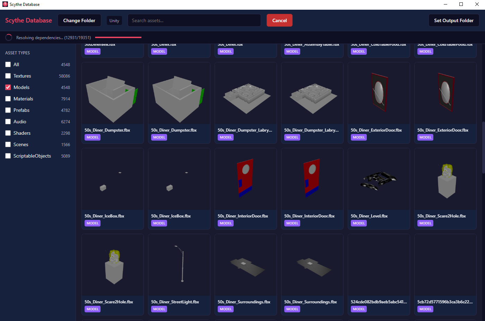
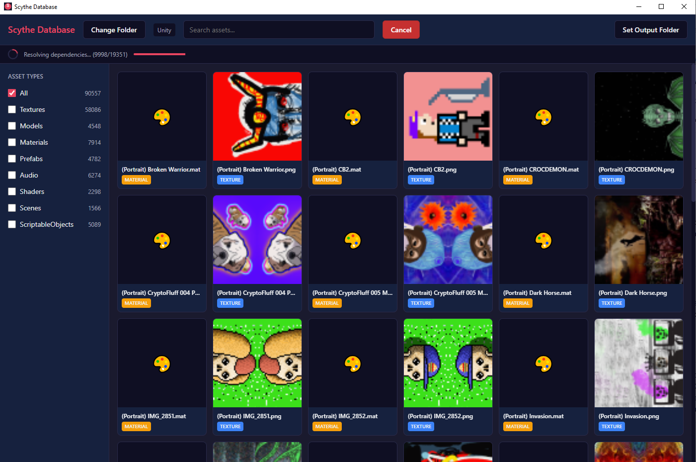

# Scythe Database

A lightweight, local-first asset database browser. No cloud. No subscriptions. Just your assets, indexed and searchable.

## Screenshots





## The Problem

Asset libraries grow. Fast. Before you know it, you're staring at 50,000+ files across hundreds of folders, hunting for that one texture you know exists *somewhere*. Explorer search is slow. Asset store solutions want your money and your data. You just want to find your files.

## The Solution

Scythe Database indexes any folder locally and gives you:

- **Instant search** across all assets with full-text search
- **Visual thumbnails** for textures, materials, and PSD files
- **3D model previews** with orbit controls (OBJ, FBX, GLTF)
- **Dependency tracking** - see what uses what via Unity GUIDs
- **Bundle export** - export an asset with all its dependencies in one click
- **Zero cloud** - everything stays on your machine

## Features

### Asset Indexing
- Scans any folder recursively
- Parses Unity `.meta` files for GUIDs (when present)
- Detects asset types: textures, models, materials, prefabs, audio, shaders, scenes
- Full-text search with SQLite FTS5
- Works with Unity projects, asset packs, or any folder of assets

### Visual Previews
- **Textures**: PNG, JPG, TGA, BMP, GIF, PSD (Photoshop)
- **Materials**: Shows main texture or stylized placeholder
- **3D Models**: Real-time Three.js previews in grid AND detail view with orbit controls

### Dependency Resolution
- Parses Unity YAML files for GUID references
- Shows "Dependencies" (what this asset uses)
- Shows "Used By" (what uses this asset)
- Recursive dependency tree for bundle export

### Export
- **Export File**: Copy single asset
- **Export Bundle**: Copy asset + all dependencies with manifest

## Tech Stack

- **Frontend**: React + TypeScript + Vite
- **Backend**: Rust + Tauri v2
- **Database**: SQLite with FTS5
- **3D**: Three.js via React Three Fiber
- **Image Processing**: image crate + psd crate

## Getting Started

### Prerequisites
- Node.js 18+
- Rust 1.70+
- [Tauri CLI](https://tauri.app/v1/guides/getting-started/prerequisites)

### Development
```bash
# Install dependencies
npm install

# Run in development mode
npm run tauri dev
```

### Build
```bash
# Build for production
npm run tauri build
```

## Usage

1. **Select Folder** - Choose any folder containing assets (Unity projects, asset packs, anything)
2. **Wait for Scan** - Initial indexing takes a moment (progress shown)
3. **Browse & Search** - Filter by type, search by name
4. **Select Asset** - View details, 3D preview, dependencies
5. **Export** - Set output folder, export single file or bundle with dependencies

## License

MIT

---

Built with Rust and stubbornness.
